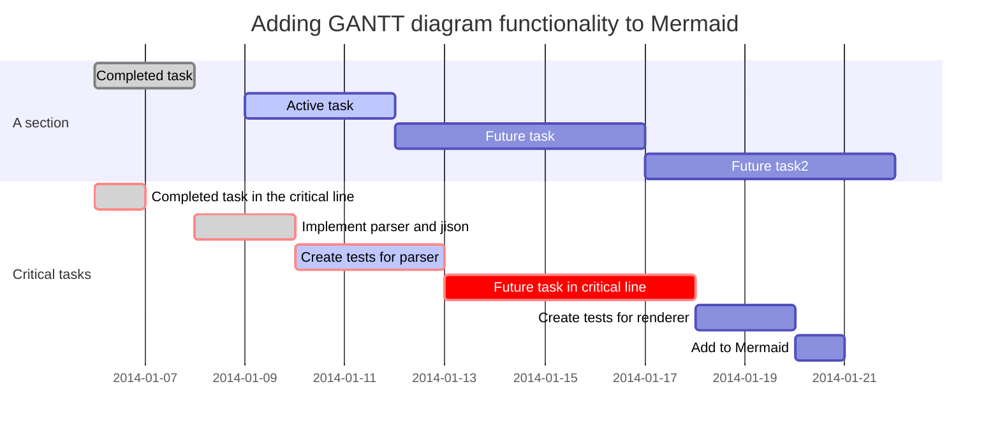
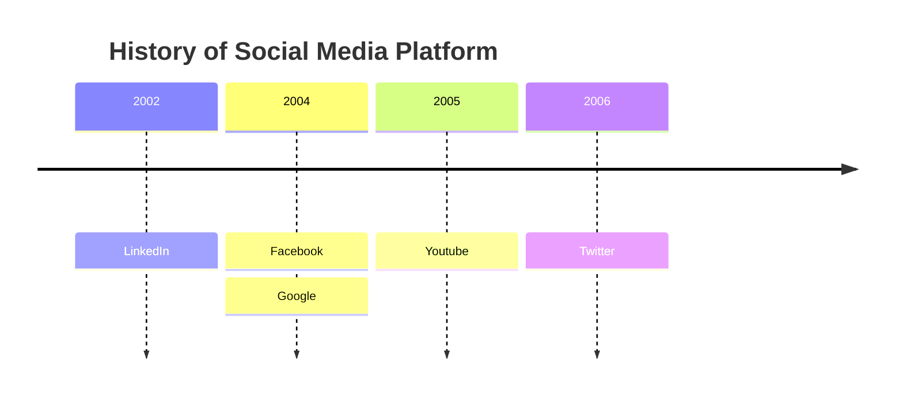
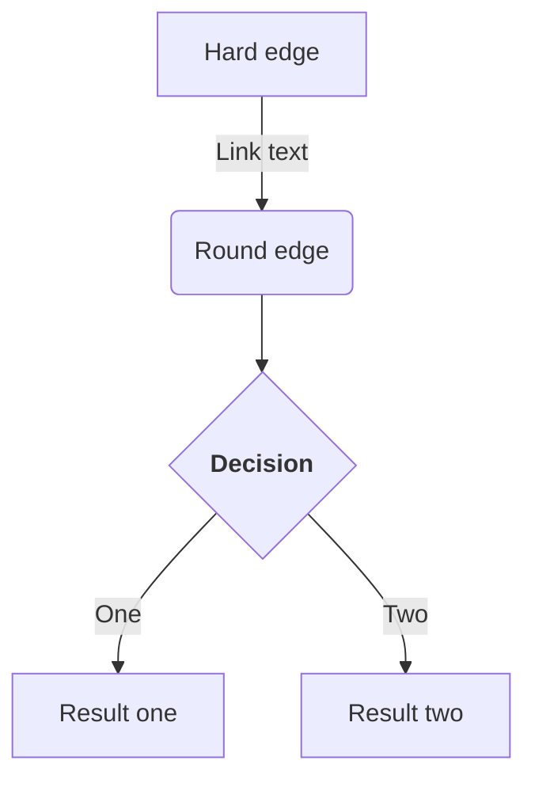

---
title: "Mermaid.js"
date: 2023-04-06
summary: "Easy embedded graphs"

tags: ["Graphs", "Tools"]
---

```mermaid
gantt
        dateFormat  YYYY-MM-DD
        title Adding GANTT diagram functionality to Mermaid
        section A section
        Completed task            :done,    des1, 2014-01-06,2014-01-08
        Active task               :active,  des2, 2014-01-09, 3d
        Future task               :         des3, after des2, 5d
        Future task2              :         des4, after des3, 5d
        section Critical tasks
        Completed task in the critical line :crit, done, 2014-01-06,24h
        Implement parser and jison          :crit, done, after des1, 2d
        Create tests for parser             :crit, active, 3d
        Future task in critical line        :crit, 5d
        Create tests for renderer           :2d
        Add to Mermaid                      :1d

```

```mermaid
timeline
    title History of Social Media Platform
    2002 : LinkedIn
    2004 : Facebook
         : Google
    2005 : Youtube
    2006 : Twitter
```

```mermaid
graph TD;
    A[Hard edge] -->|Link text| B(Round edge)
    B --> C{<strong>Decision</strong>}
    C -->|One| D[Result one]
    C -->|Two| E[Result two]
```